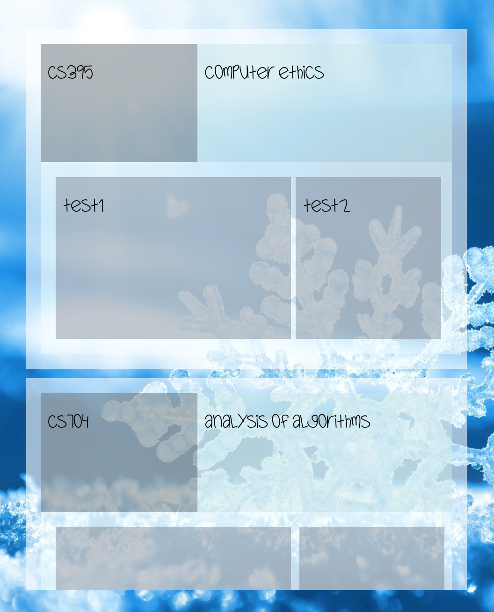
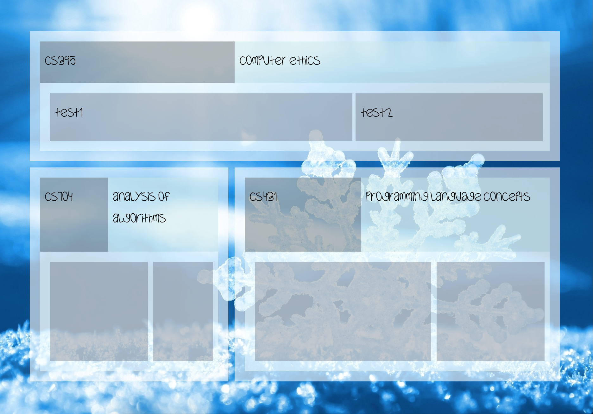
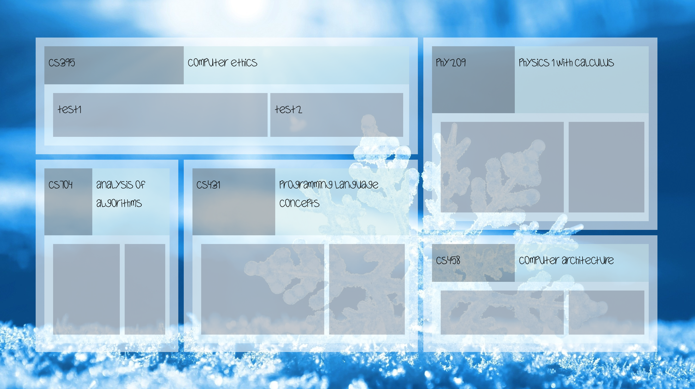

<h1>Responsive File System Dashboard </h1>

<h3>PURPOSE</h3>

<h3>MOTIVATION</h3>

<h3>DESIGN</h3>

At a high level, this project will read from a file system and interactively displays it as a web application.

A responsive design is used, here is how the layout changes with size:

<ul>
  <li>
  Width less that 600px
   
  
  </li>
  <li>
  Width between 600px and 1024px
   
  
  </li>
  <li>
  Width greater than 1024px
   
  
  </li>
</ul>

<h3>GETTING STARTED</h3>

<h3>TODO</h3>

<ul>
  <li>
  DEVELOP
  </li>
  
  <li>
  ARCHITECT
  </li>
  
  <li>
  DEPLOY
  </li>
</ul>

